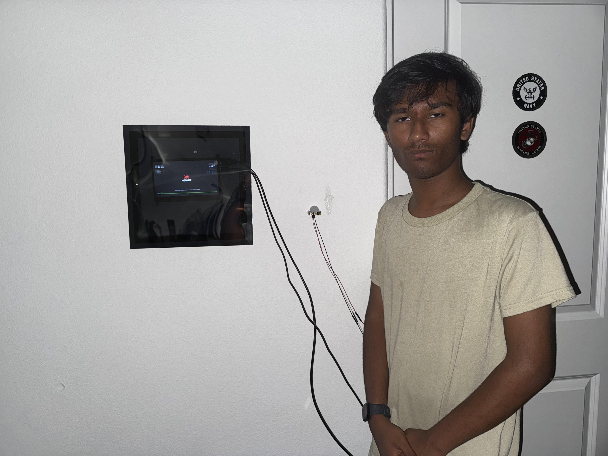

# Display Mirror
Have you ever wanted something that you could see your reflection in, check the time, check the weather, maybe even a stock of your choice? Well The MagicMirror is a perfect choice of all three! Using the power of the Raspberry Pi Computer, You can have all of this, and most importantly, you can even build it yourself!

<!---You should comment out all portions of your portfolio that you have not completed yet, as well as any instructions:-->
```HTML 
<!--- This is an HTML comment in Markdown -->
<!--- Anything between these symbols will not render on the published site -->
```

| **Engineer** | **School** | **Area of Interest** | **Grade** |
|:--:|:--:|:--:|:--:|
| Avijith G | San Marcos High | Aerospace Engineering | Incoming Senior

<!---**Replace the BlueStamp logo below with an image of yourself and your completed project. Follow the guide [here](https://tomcam.github.io/least-github-pages/adding-images-github-pages-site.html) if you need help.**-->


  
# Final Milestone


<iframe width="560" height="315" src="https://www.youtube.com/embed/DCdLccGf9gs?si=qfjP5l-cxYkhE8PN" title="YouTube video player" frameborder="0" allow="accelerometer; autoplay; clipboard-write; encrypted-media; gyroscope; picture-in-picture; web-share" referrerpolicy="strict-origin-when-cross-origin" allowfullscreen></iframe>

I've succeeded in mounting the mirror with Loctite glue after two attempts. The first attempt was trying to score the mirror with a knife but it turned out to be super difficult and resulted in making the glass scratched and ruined. The Second attempt would be to cut the glass with scissors which provbed to be even worse and almost ended up getting glass shrapnel on the floor. The third part was just taking it to  a cutting service and that part was the most successful, as the glass was cut neatly without any uneven ridges and fit the frame perfectly.

<!---For your final milestone, explain the outcome of your project. Key details to include are:
- What you've accomplished since your previous milestone
- What your biggest challenges and triumphs were at BSE
- A summary of key topics you learned about
- What you hope to learn in the future after everything you've learned at BSE-->


# Second Milestone

<!---**Don't forget to replace the text below with the embedding for your milestone video. Go to Youtube, click Share -> Embed, and copy and paste the code to replace what's below.**-->

<iframe width="560" height="315" src="https://www.youtube.com/embed/2l-rQT5Aa_Y?si=sLmmUY-6b-E0UzIp" title="YouTube video player" frameborder="0" allow="accelerometer; autoplay; clipboard-write; encrypted-media; gyroscope; picture-in-picture; web-share" referrerpolicy="strict-origin-when-cross-origin" allowfullscreen></iframe>

I've currently accompllished installing a PIR sensor on my Rspberry pi 4 and successfully programming the code required to trigger the PIR sensor to shut off the screen when required. To do this. I programmed hte code withing the Config.JS file of the MAgicmirror module and typed in the PIR module. The specific code i added myself woudl be if the PIR does not detect motion after 30 seconds, it would shut off the display using a countdown clock. I've also mounted the screen and Frame on the wall and had to drill out a section of the frame so the cords could actually fit in without sticking out and potentially ruining the look. All I need to do is just glue on the Mirror which would polish it
<!---For your second milestone, explain what you've worked on since your previous milestone. You can highlight:
- Technical details of what you've accomplished and how they contribute to the final goal
- What has been surprising about the project so far
- Previous challenges you faced that you overcame
- What needs to be completed before your final milestone -->

# First Milestone


<iframe width="560" height="315" src="https://www.youtube.com/embed/R2RmPFGSYxQ?si=Y-LLg9F261IVvgS7" title="YouTube video player" frameborder="0" allow="accelerometer; autoplay; clipboard-write; encrypted-media; gyroscope; picture-in-picture; web-share" referrerpolicy="strict-origin-when-cross-origin" allowfullscreen></iframe>

My project is a device that can be used as a Mirror, a clock, a device to check the weather, and multiple other applications. Currently I've set up my Pi and linked the SSH, along with real VNC so im able to control the pi from a different device, Then I used terminal to help download the magicmirror code from Github. 

# Schematics 
<!---Here's where you'll put images of your schematics. [Tinkercad](https://www.tinkercad.com/blog/official-guide-to-tinkercad-circuits) and [Fritzing](https://fritzing.org/learning/) are both great resoruces to create professional schematic diagrams, though BSE recommends Tinkercad becuase it can be done easily and for free in the browser. -->

# Code
<!---Here's where you'll put your code. The syntax below places it into a block of code. Follow the guide [here]([url](https://www.markdownguide.org/extended-syntax/)) to learn how to customize it to your project needs. -->

```javascript
/* Config Sample
 *
 * For more information on how you can configure this file
 * see https://docs.magicmirror.builders/configuration/introduction.html
 * and https://docs.magicmirror.builders/modules/configuration.html
 *
 * You can use environment variables using a `config.js.template` file instead of `config.js`
 * which will be converted to `config.js` while starting. For more information
 * see https://docs.magicmirror.builders/configuration/introduction.html#enviromnent-variables
 */
let config = {
	address: "localhost",	// Address to listen on, can be:
							// - "localhost", "127.0.0.1", "::1" to listen on loopback interface
							// - another specific IPv4/6 to listen on a specific interface
							// - "0.0.0.0", "::" to listen on any interface
							// Default, when address config is left out or empty, is "localhost"
	port: 8080,
	basePath: "/",	// The URL path where MagicMirror² is hosted. If you are using a Reverse proxy
									// you must set the sub path here. basePath must end with a /
	ipWhitelist: ["127.0.0.1", "::ffff:127.0.0.1", "::1"],	// Set [] to allow all IP addresses
									// or add a specific IPv4 of 192.168.1.5 :
									// ["127.0.0.1", "::ffff:127.0.0.1", "::1", "::ffff:192.168.1.5"],
									// or IPv4 range of 192.168.3.0 --> 192.168.3.15 use CIDR format :
									// ["127.0.0.1", "::ffff:127.0.0.1", "::1", "::ffff:192.168.3.0/28"],

	useHttps: false,			// Support HTTPS or not, default "false" will use HTTP
	httpsPrivateKey: "",	// HTTPS private key path, only require when useHttps is true
	httpsCertificate: "",	// HTTPS Certificate path, only require when useHttps is true

	language: "en",
	locale: "en-US",   // this variable is provided as a consistent location
			   // it is currently only used by 3rd party modules. no MagicMirror code uses this value
			   // as we have no usage, we  have no constraints on what this field holds
			   // see https://en.wikipedia.org/wiki/Locale_(computer_software) for the possibilities

	logLevel: ["INFO", "LOG", "WARN", "ERROR"], // Add "DEBUG" for even more logging
	timeFormat: 12,
	units: "imperial",

	modules: [
		{
			module: "alert",
		},
		{
			module: "updatenotification",
			position: "top_bar"
		},
		{
			module: "clock",
			position: "top_left"
		},
		{
			module: "calendar",
			header: "US Holidays",
			position: "top_left",
			config: {
				calendars: [
					{
						fetchInterval: 7 * 24 * 60 * 60 * 1000,
						symbol: "calendar-check",
						url: "https://ics.calendarlabs.com/76/mm3137/US_Holidays.ics"
					}
				]
			}
		},
		
		{
			module: "weather",
			position: "top_right",
			config: {
				weatherProvider: "openmeteo",
				type: "current",
				lat: 33.1306,
				lon: -117.1754
			}
		},
               {
                 module: "helloworld",
                 position: "middle_center",
                 config: {
                   text: ""
                 }
               },
               {

			module: "weather",
			position: "top_right",
			header: "Weather Forecast",
			config: {
				weatherProvider: "openmeteo",
				type: "forecast",
				lat: 33.1306,
				lon: -117.1754
			}
		},
		{
			module: "newsfeed",
			position: "bottom_bar",
			config: {
				feeds: [
					{
						title: "New York Times",
						url: "https://rss.nytimes.com/services/xml/rss/nyt/HomePage.xml"
					}
				],
				showSourceTitle: true,
				showPublishDate: true,
				broadcastNewsFeeds: true,
				broadcastNewsUpdates: true
			}
		},
{
    module: "MMM-PresenceScreenControl",
    position: "bottom_bar",
    config: {
        mode: "PIR_MQTT",
        pirGPIO: 4,
        mqttServer: "mqtt://localhost:1883",
        mqttTopic: "sensor/presence",
        mqttPayloadOccupancyField: "presence",
        mqttUser: "",
        mqttPassword: "",
        // Updated commands for Wayland using wlopm
        onCommand: "wlopm --on HDMI-A-1",
        offCommand: "wlopm --off HDMI-A-1",
        counterTimeout: 30,
        startupGracePeriod: 0,
        autoDimmer: true,
        autoDimmerTimeout: 60,
        autoDimmerOpacity: 0.2,
        cronIgnoreWindows: [
            { from: "01:00", to: "05:00", days: [1,2,3,4,5] },
            { from: "01:00", to: "05:00", days: [0,6] }
        ],
        cronAlwaysOnWindows: [
            { from: "07:00", to: "08:30", days: [1,2,3,4,5] },
            { from: "07:00", to: "09:00", days: [0,6] }
        ]
    }
},


	]
};

/*************** DO NOT EDIT THE LINE BELOW ***************/
if (typeof module !== "undefined") { module.exports = config; }
```


# Bill of Materials


| **Part** | **Note** | **Price** | **Link** |
|:--:|:--:|:--:|:--:|
| Raspberry Pi Kit | Serves as the Main computer for the mirror | $147.69 | <a href="[https:https://www.amazon.com/RasTech-Raspberry-Starter-Heatsink-Screwdriver/dp/B0C8LV6VNZ/ref=sr_1_4?crid=3506HY00MCGVM&dib=eyJ2IjoiMSJ9._zkM62vSQ8p7tNr88715LdMv_qHh72Je-tkF9PXEa3chDE53QT4aZu4AGAb4ihE61QY4ZD55nKF6Fp2Kfs8t7AbafM_JrlJFfHo9OB4eAVGqa0EB-7aoBQHPmhKHZ2MW8ny-Kd44bMVlVxPlTWVk5YHIN5P3uKVqrE5Dcal0rKkHny-O6Xyb5ux2AOU6OwVbkag_bqBX66RQNRrgBuz-0pS43mcx93IZTQA9R8NaJJypYU2HAycp-XicTFmyU60a01Nfm9iuyo6B9yA8ppN3OQQyJ-NQ9xyNPxfTLwkqtng.yAYpU6outhQcZmOZhN9Wb6yTw7A85CNUbXZguGInZNg&dib_tag=se&keywords=raspberry%2Bpi%2Bkit&qid=1718848547&s=electronics&sprefix=rasbperry%2Bpi%2Bkit%2Celectronics%2C83&sr=1-4&th=1]"> Link </a> |
| Monitor | Displays the Mirror UI and acts as the screen | $41.35 | <a href="https://www.amazon.com/Hosyond-Display-1024%C3%97600-Capacitive-Raspberry/dp/B09XKC53NH/ref=sr_1_3?crid=1KKB9WC62OIAD&keywords=raspberry%2Bpi%2Bips&qid=1685911698&s=electronics&sprefix=raspberry%2Bpi%2Bips%2B%2Celectronics%2C87&sr=1-3&th=1#customerReviews"> Link </a> |
| Screwdriver Kit | Mounts the screen(and the entire mirror) onto the wall | $5.94 | <a href="https://www.amazon.com/Small-Screwdriver-Set-Mini-Magnetic/dp/B08RYXKJW9/"> Link </a> 
| Terminal Breakout Board | Functions as an extender for jumper wires, connecting the pi to another device | $9.90 | <a href= "https://www.amazon.com/dp/B0DMNJ17PD?ref=ppx_yo2ov_dt_b_fed_asin_title"> Link </a> |

# Other Resources/Examples
<!---One of the best parts about Github is that you can view how other people set up their own work. Here are some past BSE portfolios that are awesome examples. You can view how they set up their portfolio, and you can view their index.md files to understand how they implemented different portfolio components.
- [Example 1](https://trashytuber.github.io/YimingJiaBlueStamp/)
- [Example 2](https://sviatil0.github.io/Sviatoslav_BSE/)
- [Example 3](https://arneshkumar.github.io/arneshbluestamp/)-->

<!---To watch the BSE tutorial on how to create a portfolio, click here.-->
